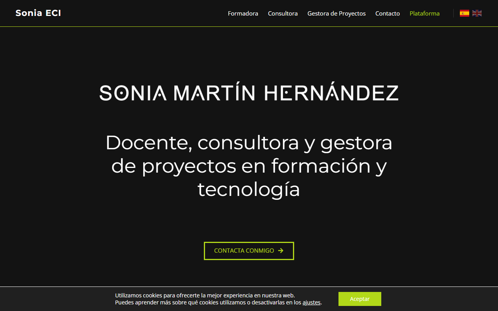
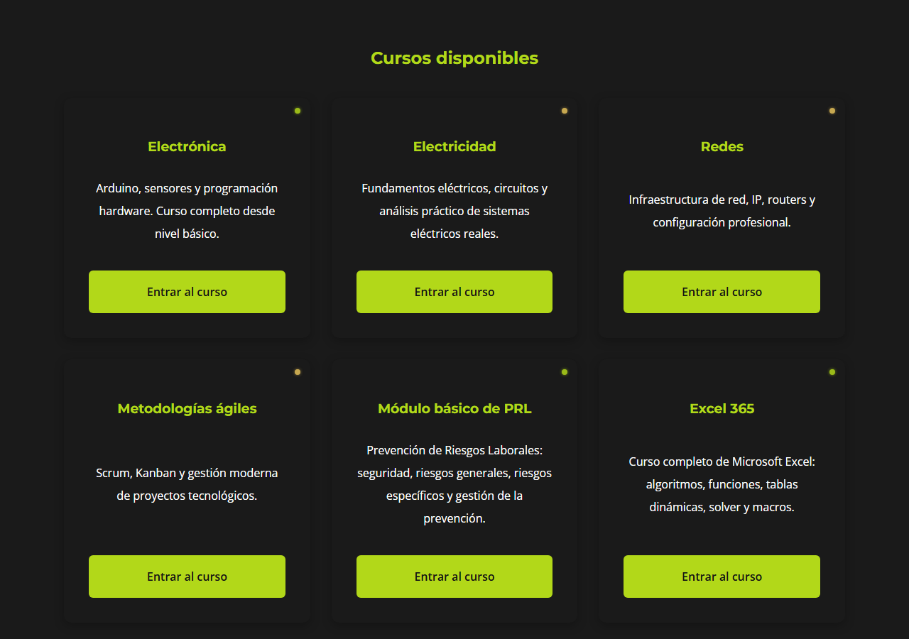
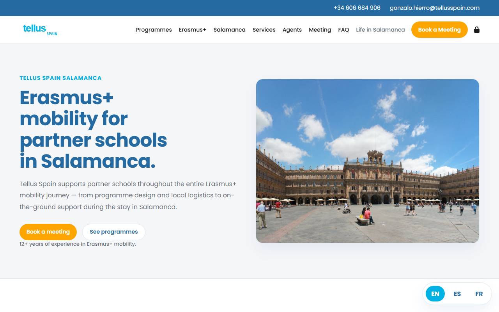
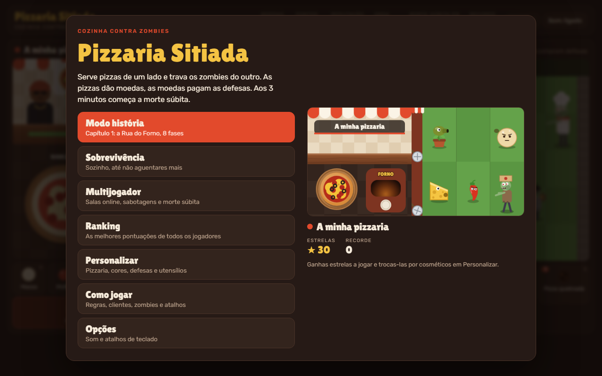

## Hi, I'm Gabriel 👋

I design and build websites and web platforms for small businesses, trainers and schools, from the public site to the private tools behind it.

📫 gabrielsvarela1@gmail.com

---

### Sonia ECI · [soniaeci.es](https://soniaeci.es/)

Professional website and online learning platform for Sonia Martín Hernández, a trainer, consultant and tech project manager in Salamanca who has taught since 1996.

<table>
  <tr>
    <td width="50%"></td>
    <td width="50%"></td>
  </tr>
</table>

- **Learning platform with student login.** I turned the school's paper exercise books into structured online lessons, each course going step by step from basic to advanced.
- **Six courses:** electronics (Arduino, sensors, microcontrollers), electricity (circuits and analysis), networking (IP, routers, configuration), agile methods (Scrum, Kanban), workplace safety (PRL) and Excel 365.
- Downloadable technical material so students can also study offline.
- Bilingual (ES · EN) public site covering her teaching, consulting and project-management work, with her CV and GDPR pages.

---

### Tellus Spain · [tellusspain.es](https://tellusspain.es/)

Website for an Erasmus+ mobility provider that hosts vocational students and teachers from European partner schools in Salamanca.

- **Trilingual site (EN · ES · FR)** for school coordinators: programmes (TBL, PBL, WBL, Teacher Training), the Erasmus+ funding process step by step, and logistics (accommodation, transport, health care).
- **Online booking:** visitors schedule a 30-minute call through the integrated Outlook calendar.
- **"Life in Salamanca" photo gallery** of 100+ photos, filtered by programme.
- A recruitment section for Tellus Agents, plus an FAQ and GDPR pages.

---

### Personal projects

#### Pizzaria Sitiada · [play it](https://pizzaria-sitiada.vercel.app) · [code](https://github.com/gabrielsvarela1/pizzaria-sitiada)

A browser game that mixes cooking, tower defense and Tetris: serve pizzas on one side to earn coins and spend them on defenses against zombies on the other.

- Hand-written on HTML canvas in plain JavaScript, no game engine.
- Story mode (8 levels), survival and **online multiplayer** with Supabase Realtime rooms.
- Global leaderboard, unlockable cosmetics and guest accounts via anonymous auth. Scores and purchases are validated by server-side Postgres functions.

#### Flashcards · [open the app](https://gvflashcards.vercel.app) · [code](https://github.com/gabrielsvarela1/flashcards)

A mobile-first spaced-repetition flashcard app.

- The **FSRS** algorithm schedules every review, so study time goes to the cards you're about to forget.
- **AI card generation:** upload a PDF and Google Gemini suggests cards that you review before saving.
- Built with Next.js, TypeScript, Tailwind and Supabase (Auth + Postgres with Row Level Security). Installable as a PWA.

#### agent-garrison · [code](https://github.com/gabrielsvarela1/agent-garrison)

A composable AI agent runtime.
